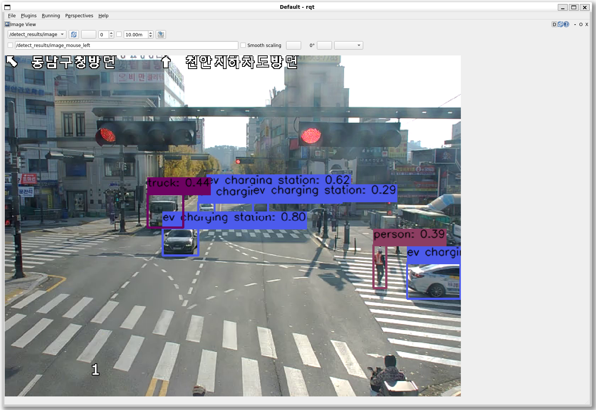

# 🤖 liborl: A Common Inference Interface Library for AI Engines for Robotic AI and Task Support

liborl is an inference interface library that allows multiple AI engines to be used through a single, common interface. It provides common tensor classes and inference interfaces that support various data types.

## Features

* No need to recompile ROS packages when changing inference accelerators (GPUs, NPUs, etc.).
* Supports enhanced reusability of ROS components using AI models.
* Dynamic switching of inference engine types based on runtime resource availability.


## Installation Instructions

Liborl can be built on x86 and ARM-based Linux-compatible systems using only cmake, OpenCV, and C++. Depending on the type of AI inference engine, installation of the CUDA toolkit or similar may be required.

### Requirements

We recommend installing the following components and versions:

Component | Recommended version 
--------- | --------------- 
gcc/g++ | 11.4.0 
cmake | ≥ 3.14 
cudatoolkit | 12.6 
cudnn | 9.3 
opencv | 4.8 

### Building from source

#### Building drivers and libraries

Building drivers for the ORIS-AI engine, drivers for TensoRT, and a common inference interface library.

```
$ cd <liborl_root>/drivers
$ mkdir build
$ cd build
$ cmake .. && make
$ cp liboris_orl.a <liborl_root>/oris_orl_py/libs
```

#### Building sensor/perception ROS component libraries

Building a liborl interface for python, a video sensor component, a water truck detection component, and an object segmentation component.

```
$ cd <liborl_root>/ros_ws
$ mkdir assets 
$ cp <liborl_root>/drivers/build/liboris_ai_driver.so .
$ cp <liborl_root>/drivers/build/liboris_trt_driver.so .
$ mkdir <liborl_root>/ros_ws/src
$ cd <liborl_root>/ros_ws/src
$ ln -s ../../oris_ai_runner .
$ ln -s ../../oris_orl_py .
$ ln -s ../../oris_video_pu_py .
$ ln -s ../../yolo_detect .
$ ln -s ../../yolo_seg .
$ cd <liborl_root>/ros_ws
$ colcon build 
```

## Run liborl Demos

### ORIS-AI-Run Quick Start

Run after the previous building process is completed.

```
$ source <liborl_root>/ros_ws/install/setup.bash
$ cd <liborl_root>/ros_ws
$ ros2 launch oris_ai_runner oris_ai_run_launch.xml config_path:=./config.json video_path:=rtsp://<rtsp_source_url>
  or
$ ros2 launch oris_ai_runner oris_ai_run_launch.xml config_path:=<mp4 directory>/input1.mp4

```

#### View ROS2 video topics

The ROS topics posted by ORIS-AI-Run Demo can be checked using ROS2's RQt.

How to use RQt can be found in https://docs.ros.org/en/humble/Concepts/Intermediate/About-RQt.html


```
sudo apt install ros-<distro>-rqt*

rqt
```

<div align="center">
  
    <p><em> Object detection demo in real-time video</em></p>
</div>


## Acknowledgement

This work was supported by Institute of Information & communications Technology Planning & Evaluation (IITP) grant funded by the Korea government(MSIT) (No. 2024-00339187, Core Technology Development of On-device Robot Intelligence SW Platform).
